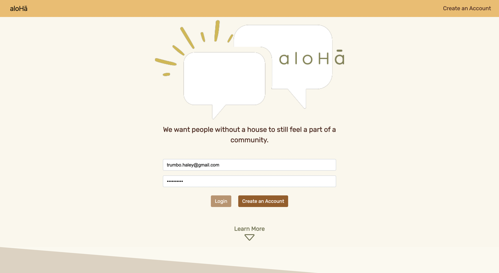
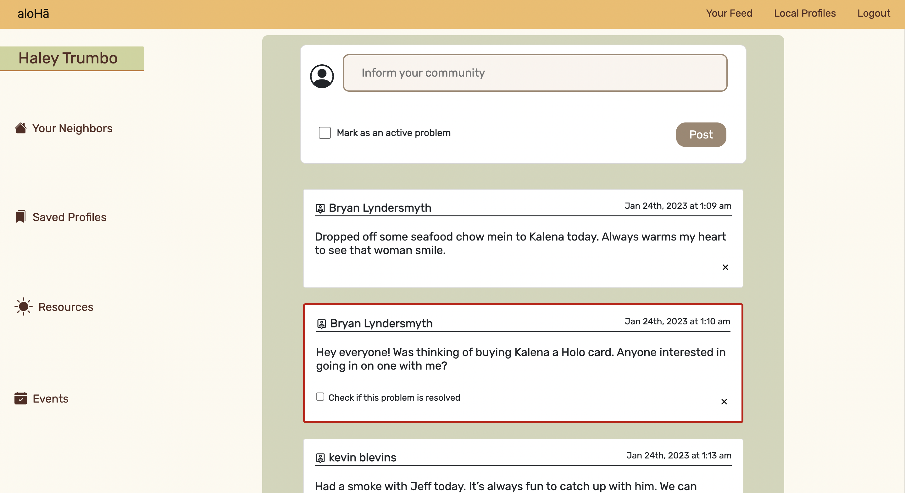

# aloHa (MERN Stack)

A social media web application built to help users connect with their community so that they can better look after the houseless individuals in their respective neighborhoods. We want people who don’t have a house to still feel a part of a community. Each houseless person has a profile with a bio and important information that guides the user to help in a real and productive way. 

## Table of Contents

Any additional information goes here

- [Links](#Links)
- [Tech Stack](#TechStack)
- [Language used](#Languageused)
- [License](#license)
- [Screenshots](#Screenshots)
- [Run Locally](#RunLocally)
- [Features](#Features)
- [Authors](#Authors)

## 🔗 Links

GitHub: https://github.com/JacquelineHockin/aloHa

Heroku: https://aloha.herokuapp.com/

## Tech Stack

**Client:** React, React-boot-strap

**Server:** MongoDB, Mongoose, Expressjs, Nodejs, webpack, Babel, nodemon

## Languages used

JavaScript

## License

[](https://choosealicense.com/licenses/mit/)

## Screenshots






## Run Locally

Clone the project

```bash
  git clone git@github.com:JacquelineHockin/aloHa.git
```

Go to the project directory

```bash
  cd aloHa
```

Install dependencies

```bash
  npm i
```

Start the server

```bash
  npm run development
```

## Features

- Users can sign-up, log-in and post for help by marking the case is open
- Users can create a profile to upload pictures and show the location and the situation
- Users in the community can offer help and change case status to close

## Authors

- Jacqueline - https://github.com/JacquelineHockin
- Haley - https://github.com/haleymay21
- Chase - https://github.com/chasebinkley
- Katie - https://github.com/KatieKim22
